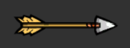

# 2DGame

This game is a simple 2D shooter where an astronaut man has to defend himself against red and green slimes attacking him. He can collect powerups along the way that can change the color of his projectiles, increase/decrease his speed, and give him extra lives.
 
 
Click [**here**](https://drive.google.com/file/d/1hVBlcKym0YSRHYSLyeFPnXLwwsS0Vm7s/view?usp=sharing) for a 1 minute demo video.

## Technical
As the entire game file is very large I chose to only include the [game scripts](Scripts) and the [prefabs](Prefabs) in this repository. All scripts are written in C#.

- **Player**
        - All player movement, shooting, and animation is controlled by the [**Player Script**](Scripts/PlayerScript.cs) 
- **Enemies**
        - All enemy movement and animation is controlled by the [**Enemy Script**](Scripts/EnemyScript.cs)
- **Destruction**
        - Ensuring an object is not deleted before an associated animation is finished is done by the [**Destruction Script**](Scripts/Destruction.cs)
- **Laser**
        - Projectile behavior is controlled by the [**Laser Script**](Scripts/LaserScript.cs)
- **Powerups**
        - Powerups behavior is controlled by the [**Power Up Script**](Scripts/PowerUpScript.cs)
- **Spawning**
        - Powerup and Enemy spawning is controlled by the [**Spawn Manager Script**](Scripts/SpawnManagerScript.cs)
- **UI**
        - UI updates are controlled through the [**UI Script**](Scripts/UIScript.cs)
- **Game**
        - Game starting, pausing, and spawn starting/stopping is controlled by the [**Game Manager Script**](Scripts/GameManagerScript.cs)

## Instructions
- **Movement**
        - Walking - moving left and right are controlled through A and D or the Arrow keys
        - Short Teleport - Q and E can be used to teleport a short distance
- **Firing** - shoot a laser bolt with space or an arrow with the J key
- **Pause** - pause and unpause are controlled through the P key
- **Play** - The space bar will start the game from the beggining or after death

### Powerups
Power ups will spawn throughout gameplay that have different effects    
PowerUp     | Effect   
---           | ---         
        |  Heals the player by one health   
        |  Doubles players speed for 7 seconds
        |  Halves players speed for 7 seconds
        |  Changes look and color of players laser bolts for 5 seconds
 | Changes look and color of players bolts for 5 seconds

### Projectiles
There are various projectiles in the game. 

Projectile     | Description    
---           | ---         
        |  Base laser bolt
        |  A green laser bolt activated through a power up
        |  A purple laser bolt activated through a power up
        |  An arrow projectile shot by using the J key

### Player health
The current player health is located in the lower right hand part of the screen and changes based upon the current number of lives.

Image    | Lives Remaining     
---           | ---         
        |  The player has all lives remaining
        |  2 lives remaining
        |  1 life remaining
        |  No lives remaining

### Enemies
There are two kinds of enemy slimes in the game.
Enemy   | Description  
---           | ---         
        |  A larger red slime that moves at a slower pace
        |  A smaller green slime that moves at 1.5 times the speed of the red slime
